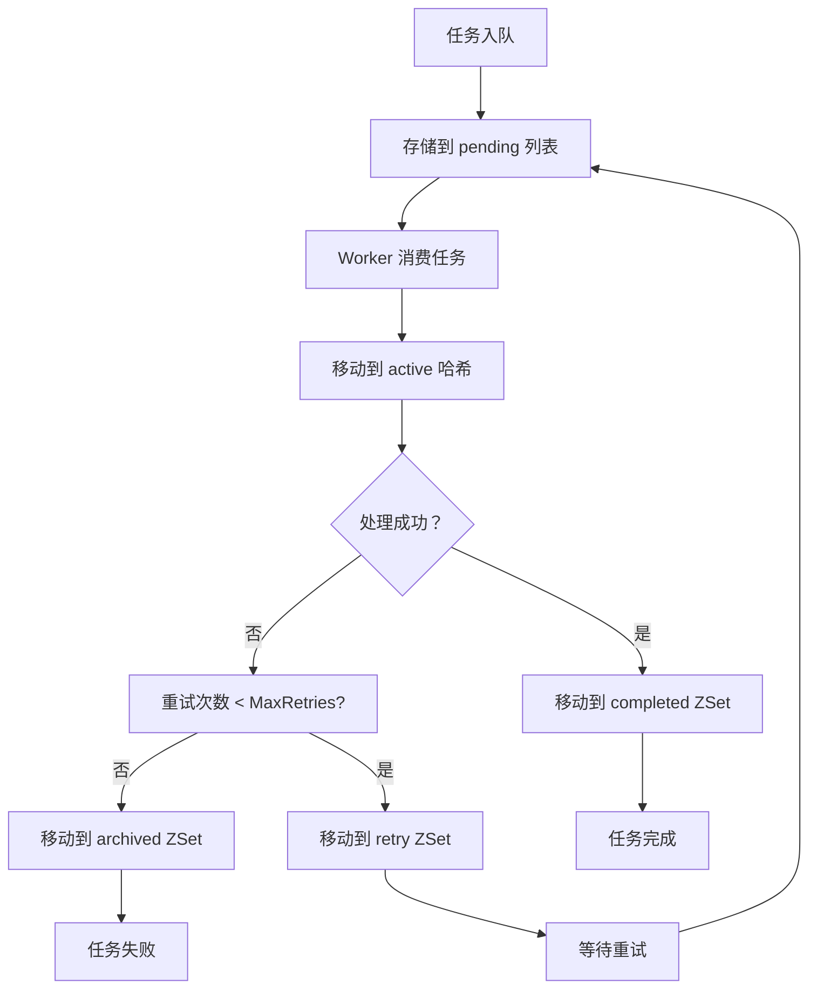

# 队列设计文档

## 概述

本文档详细说明了 QukaAI 项目中队列系统的设计架构，包括队列名称规范、Redis 存储机制、任务隔离策略和最佳实践。

## 队列架构设计

### 1. 队列命名规范

我们采用清晰的队列命名策略，为不同类型的任务分配独立的队列：

```go
// RSS 队列
TaskTypeRSSFetch = "rss:fetch"
RSSQueueName     = "rss"

// Podcast 队列
TaskTypePodcastGeneration = "podcast:generation"
PodcastQueueName          = "podcast"
```

**命名规则：**
- 任务类型（TaskType）：`{模块名}:{操作名}`，用于标识具体的任务类型
- 队列名称（QueueName）：`{模块名}`，用于任务分类和隔离

### 2. 队列隔离设计

#### 2.1 任务隔离

每个队列处理特定类型的任务：

| 队列名称 | 任务类型 | 用途 |
|----------|----------|------|
| `rss` | `rss:fetch` | RSS 订阅内容抓取 |
| `podcast` | `podcast:generation` | Podcast 音频生成 |

**隔离优势：**
- ✅ **防止任务冲突**：不同类型的任务不会相互干扰
- ✅ **独立监控**：可以单独查看各队列的状态和性能
- ✅ **灵活配置**：可为不同队列设置不同的优先级和并发度
- ✅ **故障隔离**：一个队列的问题不会影响其他队列

#### 2.2 资源隔离

不同队列在 Redis 中使用独立的键空间：

```bash
# RSS 队列的键
asynq:stat:rss
asynq:pending:rss
asynq:active:rss
asynq:scheduled:rss
asynq:retry:rss
asynq:completed:rss

# Podcast 队列的键
asynq:stat:podcast
asynq:pending:podcast
asynq:active:podcast
asynq:scheduled:podcast
asynq:retry:podcast
asynq:completed:podcast
```

## Redis 存储机制

### 1. 键命名规则

asynq 使用以下命名规则组织 Redis 中的数据：

```
asynq:{数据域}:{队列名}
```

**数据域说明：**

| 数据域 | 数据结构 | 用途 |
|--------|----------|------|
| `stat` | Hash | 队列统计信息（任务数量、最后处理时间等） |
| `pending` | List | 等待处理的任务队列（FIFO） |
| `active` | Hash | 正在处理的任务（避免重复处理） |
| `scheduled` | ZSet | 定时任务（按执行时间排序） |
| `retry` | ZSet | 重试任务（按重试时间排序） |
| `archived` | ZSet | 归档任务（已处理完成的任务） |
| `completed` | ZSet | 已完成任务（按完成时间排序） |
| `task` | String | 单个任务的详细信息（JSON 格式） |

### 2. 数据结构详解

#### 2.1 pending 列表（List）
- **用途**：存储等待处理的任务
- **操作**：FIFO（先进先出）
- **命令**：`LPUSH` 添加，`BRPOP` 消费
- **示例**：
  ```bash
  redis-cli LPUSH asynq:pending:rss "task_id_1"
  redis-cli LPUSH asynq:pending:rss "task_id_2"
  redis-cli BRPOP asynq:pending:rss 0  # 获取 task_id_1
  ```

#### 2.2 active 哈希（Hash）
- **用途**：存储正在处理的任务，防止重复处理
- **键**：`task_id`
- **值**：任务详细信息（JSON）
- **示例**：
  ```bash
  redis-cli HSET asynq:active:rss task_id_1 '{"payload": "...", "max_retry": 3}'
  ```

#### 2.3 有序集合（ZSet）
- **用途**：`scheduled`、`retry`、`completed` 使用
- **成员**：`task_id`
- **分数**：时间戳（秒）
- **示例**：
  ```bash
  redis-cli ZADD asynq:scheduled:rss 1703123456.789 task_id_1
  redis-cli ZRANGEBYSCORE asynq:scheduled:rss -inf +inf LIMIT 0 10
  ```

### 3. 任务生命周期



## 队列配置

### 1. 队列优先级配置

在 asynq 服务器配置中为不同队列设置优先级：

```go
asynq.Config{
    Queues: map[string]int{
        "podcast": 10, // 高优先级，音频生成需要及时处理
        "rss":     5,  // 中优先级，内容抓取可以稍后处理
        "default": 1,  // 低优先级，其他任务
    },
}
```

**优先级规则：**
- 数值越大，优先级越高
- 高优先级队列的任务会先被处理
- 建议：为延迟敏感的任务设置更高优先级

### 2. 任务配置

#### 2.1 RSS 任务配置
```go
_, err = client.EnqueueContext(ctx, asynq.NewTask(TaskTypeRSSFetch, payload,
    asynq.MaxRetry(3),                    // 最多重试3次
    asynq.Timeout(15*time.Minute),       // 15分钟超时
    asynq.Unique(time.Hour),              // 1小时内不重复
    asynq.Queue(RSSQueueName),            // 指定 rss 队列
))
```

#### 2.2 Podcast 任务配置
```go
_, err = client.EnqueueContext(ctx, asynq.NewTask(TaskTypePodcastGeneration, payload,
    asynq.MaxRetry(3),                    // 最多重试3次
    asynq.Timeout(30*time.Minute),       // 30分钟超时（TTS 生成较慢）
    asynq.Unique(5*time.Minute),          // 5分钟内不重复
    asynq.Queue(PodcastQueueName),        // 指定 podcast 队列
))
```

**配置参数说明：**
- `MaxRetry`：任务失败时的最大重试次数
- `Timeout`：任务执行超时时间
- `Unique`：唯一性约束时间窗口，避免重复处理
- `Queue`：指定任务进入的队列

## 监控和管理

### 1. 队列状态监控

#### 1.1 通过 Inspector API 监控
```go
inspector := asynq.NewInspector(redisClientOpt)
queueInfo, err := inspector.GetQueueInfo("rss")
if err != nil {
    log.Printf("Failed to get queue info: %v", err)
    return
}

log.Printf("RSS Queue Stats: Size=%d, Active=%d, Pending=%d, Processed=%d, Failed=%d",
    queueInfo.Size, queueInfo.Active, queueInfo.Pending,
    queueInfo.Processed, queueInfo.Failed)
```

#### 1.2 通过 Redis CLI 监控
```bash
# 查看所有队列
redis-cli HGETALL asynq:stat

# 查看 RSS 队列的统计信息
redis-cli HGETALL asynq:stat:rss

# 查看 RSS 待处理任务数量
redis-cli LLEN asynq:pending:rss

# 查看 RSS 活跃任务
redis-cli HGETALL asynq:active:rss

# 查看 RSS 定时任务（未来1小时内的任务）
redis-cli ZRANGEBYSCORE asynq:scheduled:rss $(date +%s) $(($(date +%s) + 3600))
```

### 2. 任务管理

#### 2.1 查看任务详情
```bash
# 查看特定任务
redis-cli GET asynq:task:{task_id}
```

#### 2.2 取消任务
```go
inspector := asynq.NewInspector(redisClientOpt)
err := inspector.CancelProcessing(taskID)
if err != nil {
    log.Printf("Failed to cancel task: %v", err)
}
```

#### 2.3 归档任务
```go
// 归档所有已完成的 RSS 任务
count, err := inspector.DeleteAllCompletedTasks("rss")
log.Printf("Archived %d completed RSS tasks", count)
```

## 性能优化

### 1. 队列并发度配置

```go
asynq.Config{
    Concurrency: 10, // 根据 CPU 核数调整
    Queues: map[string]int{
        "podcast": 10, // 高优先级队列配置更多并发
        "rss":     5,  // 中优先级队列配置中等并发
    },
}
```

**优化建议：**
- Concurrency 设置为 CPU 核数的 1-2 倍
- 为高优先级队列配置更多并发资源
- 监控队列延迟，及时调整并发度

### 2. 任务大小优化

**建议：**
- 任务载荷（payload）应尽量小，建议 < 1KB
- 大数据通过对象存储（如 S3）传递，任务中只存储引用
- Podcast 生成中，只传递 podcast_id，实际音频文件存储在 S3

### 3. Redis 性能优化

**配置建议：**
```bash
# Redis 配置文件优化
maxmemory 2gb          # 根据数据量调整
maxmemory-policy allkeys-lru  # 内存不足时清理最少使用的键
save 900 1             # RDB 持久化配置
save 300 10
save 60 10000
```

## 最佳实践

### 1. 任务设计

#### 1.1 幂等性
- 任务应该是幂等的，多次执行不会产生副作用
- 使用 `asynq.Unique` 避免重复处理
- Podcast 生成任务：检查 podcast 状态，避免重复生成

#### 1.2 错误处理
- 区分可恢复错误和不可恢复错误
- 可恢复错误（如网络超时）：重试
- 不可恢复错误（如参数错误）：直接失败并记录

#### 1.3 任务粒度
- 保持任务粒度适中，单个任务执行时间 1-30 秒
- Podcast 生成：单个音频生成作为一个任务
- RSS 抓取：单个订阅抓取作为一个任务

### 2. 队列管理

#### 2.1 任务监控
- 定期检查队列长度和延迟
- 设置告警阈值，及时处理积压
- 监控失败任务比例

#### 2.2 资源清理
- 定期清理已完成的任务（completed、archived）
- 设置合理的任务保留时间
- 监控 Redis 内存使用情况

### 3. 错误恢复

#### 3.1 死信队列
```go
// 超过最大重试次数的任务移到归档队列
asynq.MaxRetry(3)
asynq.ProcessIn(retryDelay)
```

#### 3.2 任务补偿
- 对于失败的任务，可以创建补偿任务
- Podcast 生成失败：创建重新生成任务
- RSS 抓取失败：标记订阅状态，延迟后重试

## 故障排除

### 1. 常见问题

#### 1.1 队列积压
**症状**：队列长度持续增长，任务延迟增加

**原因**：
- Worker 并发度不足
- 任务执行时间过长
- Redis 性能问题

**解决方案**：
- 增加并发度
- 优化任务处理逻辑
- 检查 Redis 性能

#### 1.2 任务丢失
**症状**：任务入队后没有被处理

**原因**：
- Worker 未正常启动
- Redis 连接问题
- 队列配置错误

**解决方案**：
- 检查 Worker 日志
- 验证 Redis 连接
- 确认队列名称正确

#### 1.3 重复处理
**症状**：同一任务被处理多次

**原因**：
- 未设置 `Unique` 约束
- Worker 崩溃导致任务未正确标记

**解决方案**：
- 为任务添加唯一性约束
- 实现任务幂等性
- 检查 Worker 健康状态

### 2. 调试技巧

#### 2.1 启用详细日志
```go
logger := asynq.NewLogger()
server := asynq.NewServer(redisClientOpt, asynq.Config{
    Logger: logger,
})
```

#### 2.2 任务追踪
```go
// 为任务添加追踪ID
task := asynq.NewTask(TaskTypeRSSFetch, payload,
    asynq.TaskID(taskID),
    asynq.Queue(RSSQueueName),
)
```

## 相关文档

- [Redis 配置重构文档](../feature-plans/redis-configuration-refactoring.md)
- [Podcast Queue 测试指南](../testing/podcast-queue-test-guide.md)
- [Asynq 官方文档](https://github.com/hibiken/asynq)
- [Redis 数据类型文档](https://redis.io/docs/latest/develop/data-types/)

## 更新记录

| 日期 | 版本 | 更新内容 |
|------|------|----------|
| 2025-12-14 | v1.0 | 初始版本，定义队列命名规范和基本架构 |
| 2025-12-14 | v1.1 | 添加 RSS 队列支持，完善队列隔离设计 |
| 2025-12-14 | v1.2 | 添加监控和管理指南，优化性能建议 |