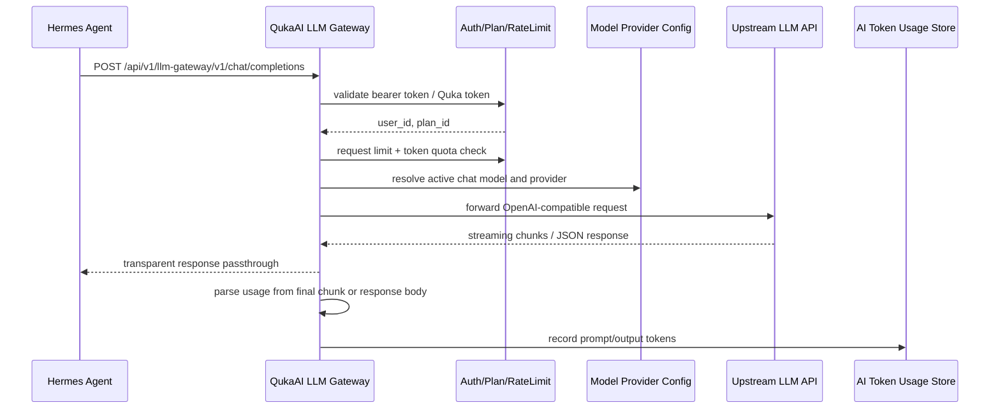

# Hermes Agent 服务端 LLM Gateway 实现方案

## 背景

WebApp desktop 模式已经集成 Hermes Agent，但当前需要用户在前端手动配置 LLM provider 的 `baseURL`、`apiKey` 和 `modelName`。这会带来几个问题：

- 用户需要自行准备第三方 LLM API 服务，首次使用门槛高。
- 第三方 API Key 保存在 desktop 本地配置中，安全和运维体验都不理想。
- 服务端无法基于 QukaAI 用户身份和会员等级做统一限流。
- 服务端无法可靠统计 Hermes Agent 消耗的 token usage。

目标是在 QukaAI 服务端内置一个 OpenAI-compatible LLM Gateway，让 Hermes Agent 继续以 OpenAI Chat Completions 方式调用，但 provider 配置、鉴权、限流和 usage 统计都由服务端接管。

## 调研结论

### charmbracelet/fantasy 可行性评估

`charmbracelet/fantasy` 的定位是 “Build AI agents with Go. Multi-provider, multi-model, one API.”，核心价值是把 OpenAI、OpenRouter、Bedrock、Google 等 provider 抽象成统一的 `fantasy.LanguageModel` / `fantasy.Agent` API。它不是一个现成的 OpenAI-compatible HTTP reverse proxy。

Fantasy 的优点：

- 有 `providers/openaicompat`，能接入 OpenAI-compatible provider。
- 流式调用里会自动设置 `stream_options.include_usage=true`。
- 能把最终 usage 转换成 `fantasy.Usage`。
- 适合服务端自己发起 agent 调用、工具调用、多 provider 抽象。

但它不适合作为本次 Gateway 的转发实现：

- Gateway 目标是“原样转发 OpenAI Chat Completions 请求和响应”，Fantasy 会把请求转换成自己的 `fantasy.Call` / `Prompt`，响应转换成 `StreamPart`。
- 如果用 Fantasy，服务端需要把客户端 OpenAI 请求解析成 Fantasy Call，再把 Fantasy StreamPart 反向组装成 OpenAI SSE chunk，复杂度反而更高。
- Hermes 可能会使用 OpenAI-compatible 请求中的未知字段、tools、tool_choice、provider 扩展字段。透明代理可以天然保留这些字段，Fantasy 抽象层可能丢失或改写部分字段。
- Fantasy 当前 `go.mod` 使用 `go 1.26.4`，依赖 `charm.land/fantasy`、`github.com/charmbracelet/openai-go` 和大量多 provider 依赖；QukaAI 当前已使用 `github.com/sashabaranov/go-openai`，引入 Fantasy 会显著增加依赖面。

结论：本次 Gateway 不建议使用 Fantasy 作为转发层。推荐直接用 Go 标准库 `net/http` 实现透明代理，只做认证、限流、请求体少量改写、SSE usage 捕获和 usage 入库。Fantasy 可以作为未来“服务端内置 agent runtime”或“多 provider 统一调用 SDK”的候选，但不是这个 OpenAI-compatible Gateway MVP 的最佳工具。

### 后端现状

- 认证入口在 `cmd/service/middleware/middleware.go`：
  - 当前标准认证支持 `X-Access-Token` 和 `X-Authorization`。
  - `Authorization: Bearer ...` 目前只在 MCP 相关逻辑中单独支持，不适合作为通用 API 认证。
- 用户等级字段已存在：
  - `pkg/types/user_plan.go` 定义了 `basic`、`pro`、`ultra`。
  - `security.TokenClaims` 中已有 `PlanID()`，`PaymentRequired` 已基于该字段判断付费能力。
- 现有限流入口：
  - `cmd/service/router.go` 中封装了 `userLimit`、`spaceLimit`、`aiLimit`。
  - `pkg/plugins/selfhost/selfhost.go` 使用进程内 `rate.Limiter`，默认每分钟 60。
  - `core.WithRange` 已定义，但 selfhost limiter 当前没有真正使用 `Every` 字段，需要补齐。
- usage 统计表已存在：
  - `quka_ai_token_usage` 记录 `space_id`、`user_id`、`type`、`sub_type`、`model`、`usage_prompt`、`usage_cache`、`usage_output`、`created_at`。
  - 现有业务通过 `process.NewRecordUsageRequest`、`NewRecordChatUsageRequest` 等异步写入。
- 模型 provider 已由管理员配置：
  - `ModelProvider.ApiUrl`、`ApiKey`、`ModelConfig.ModelName` 已存在。
  - API Key 已通过 `core.EncryptData` 加密存储。
  - `Core.GetActiveModelConfig(ctx, types.AI_USAGE_CHAT)` 可以找到当前聊天模型。

### 前端/Hermes 现状

- desktop Hermes 配置结构在 `/Users/wangboyan/development/quka/webapp/quka-desktop/hermes.go`：
  - `HermesProviderConfigureRequest` 需要 `modelName`、`baseURL`、`apiKey`。
  - 写入 Hermes 配置时固定 `provider=custom`、`api_mode=chat_completions`。
- Hermes runtime 调用 `AIAgent` 时会传入：
  - `model`
  - `base_url`
  - `api_key`
  - `api_mode=chat_completions`
- 因此服务端 Gateway 最小可行形态应兼容 OpenAI Chat Completions：
  - `POST /v1/chat/completions`
  - 可选 `GET /v1/models`

### LLM usage 捕获机制

OpenAI Chat Completions 的流式 usage 需要请求体设置：

```json
{
  "stream": true,
  "stream_options": {
    "include_usage": true
  }
}
```

根据 OpenAI 官方 API Reference，开启后流式响应会在结束前额外发送一个 chunk，该 chunk 的 `usage` 字段包含整次请求 token 使用量，其它普通 chunk 的 `usage` 为 `null`；如果流被中断，最终 usage chunk 可能无法收到。

参考：

- https://platform.openai.com/docs/api-reference/chat/create
- https://platform.openai.com/docs/api-reference/chat/streaming

这意味着 Gateway 必须在转发前主动注入 `stream_options.include_usage=true`，同时在转发 SSE 数据给客户端时旁路解析最后的 usage chunk。

## 设计目标

1. 用户不再需要配置第三方 LLM API Key。
2. Hermes Agent 使用用户登录后的 QukaAI 授权调用服务端 Gateway。
3. 服务端根据用户等级执行不同的请求限流和 token 配额策略。
4. Gateway 透明转发 OpenAI-compatible Chat Completions 请求和响应。
5. Gateway 能捕获非流式响应的 `usage`，也能捕获流式响应最后 usage chunk。
6. usage 统一写入现有 `quka_ai_token_usage` 表。
7. MVP 不引入新的 Agent 协议，不重写 Hermes runtime。

## 推荐架构



## API 设计

### Gateway Base URL

建议前端 desktop 自动配置：

```text
baseURL = {apiBaseURL}/llm-gateway/v1
modelName = quka-hermes
apiKey = 当前登录 token 或 Gateway 专用临时 token
```

Hermes runtime 会调用：

```text
POST {baseURL}/chat/completions
```

对应后端路由：

```text
POST /api/v1/llm-gateway/v1/chat/completions
GET  /api/v1/llm-gateway/v1/models
```

### 认证方式

Gateway 需要支持 OpenAI-compatible 客户端常见的 Header：

```http
Authorization: Bearer <token>
```

同时兼容现有 QukaAI Header：

```http
X-Authorization: <auth-token>
X-Access-Token: <access-token>
```

推荐新增 Gateway 专用认证中间件：

- 优先解析 `Authorization: Bearer ...`。
- Bearer token 可以按现有 auth token 校验，也可以按 access token 校验。
- 校验成功后写入 `TOKEN_CONTEXT_KEY`。
- 鉴权失败时返回 OpenAI-compatible error JSON，但错误码仍使用 `pkg/i18n` 中已有或新增错误码。

后续如果担心把登录态 token 写入 Hermes 本地配置，可以增加：

```text
POST /api/v1/llm-gateway/token
```

由登录态换取短 TTL、仅限 LLM Gateway 使用的临时 token。

## 模型和 Provider 解析

MVP 推荐复用项目现有的模型配置体系，不新增一套 Gateway provider 配置。当前项目已经有：

- `quka_model_provider`：保存 provider 的 `api_url`、加密后的 `api_key`、`config`。
- `quka_model_config`：保存具体模型的 `model_name`、`model_type`、`thinking_support`、`config`。
- `quka_custom_config`：通过 `AI_USAGE_CHAT`、`AI_USAGE_CHAT_THINKING` 等 usage key 指向当前启用模型。
- 管理接口：`/api/v1/admin/model/providers`、`/api/v1/admin/model/configs`、`/api/v1/admin/ai/system/usage`。

因此 Gateway 配置推荐分两层：

### MVP 配置

直接复用 `AI_USAGE_CHAT` 当前激活模型：

1. Gateway 收到请求后读取请求体中的 `model`。
2. 如果 `model` 为空或为 `quka-hermes`，映射到 `AI_USAGE_CHAT` 当前激活模型。
3. 如果 `model` 等于当前激活模型的真实 `ModelName`，允许透传。
4. 其它 model 默认拒绝，返回 `400 model_not_allowed`。
5. 通过 `Core.GetActiveModelConfig(ctx, types.AI_USAGE_CHAT)` 获取模型配置。
6. 读取关联 `ModelProvider`，解密 `ApiKey`。
7. 将上游请求地址规范化为：

```text
{provider.ApiUrl}/chat/completions
```

如果 provider 的 `ApiUrl` 已经包含 `/chat/completions`，则直接使用，避免重复拼接。

注意：`loadAIConfigFromDB` 在服务启动和 `ReloadAI` 时会解密 provider key，但 `Core.GetActiveModelConfig` 当前会重新从数据库读取 provider，返回的 `Provider.ApiKey` 可能仍是加密态。Gateway 实现时需要二选一：

- 在 Gateway 解析模型配置后显式调用 `core.DecryptData([]byte(model.Provider.ApiKey))`。
- 或新增 `Core.GetActiveModelConfigForInvoke(ctx, usageKey string)` 这类 helper，统一返回已解密、已校验 status 的模型配置。

我建议新增 helper，避免未来其它调用点重复处理解密和状态校验。

### 后续可选配置

如果不希望 Gateway 和站内聊天共用同一个模型，可以新增 usage key：

```go
const AI_USAGE_LLM_GATEWAY = "ai_usage_llm_gateway"
```

然后在 admin AI usage 配置中增加 `llm_gateway` 字段：

```json
{
  "chat": "chat-model-id",
  "embedding": "embedding-model-id",
  "llm_gateway": "gateway-chat-model-id"
}
```

解析顺序建议：

1. 优先使用 `AI_USAGE_LLM_GATEWAY`。
2. 如果未配置，fallback 到 `AI_USAGE_CHAT`。
3. 如果两者都没有配置，返回 Gateway 未配置错误。

这个扩展不需要新增 provider 表或新配置页面，只是在现有“AI 系统使用配置”里多一个使用场景。

## 透传策略

### 请求透传

Gateway 应保留 OpenAI Chat Completions 请求体中的未知字段，避免破坏 Hermes Agent 使用的 tools、tool_choice、temperature、max_tokens 等参数。

处理步骤：

1. 使用 `http.MaxBytesReader` 或 `io.LimitReader` 限制请求体大小。
2. 解析为 `map[string]any`，只修改必要字段：
   - 重写 `model` 为真实上游模型名。
   - 如果 `stream=true`，注入或合并：

```json
"stream_options": {
  "include_usage": true
}
```

3. 使用后端 provider API Key 设置上游 `Authorization: Bearer <provider-key>`。
4. 请求上游时设置 `Accept-Encoding: identity`，避免 OpenAI-compatible agent 收到不可直接消费的压缩 SSE/JSON。
5. 只透传安全 Header，例如：
   - `Content-Type`
   - `Accept`
   - `OpenAI-Organization` 可按需禁用
   - 不透传客户端 `Authorization` 到上游

### 响应透传

Gateway 不能使用现有 `response.APISuccess` 包装响应，否则会破坏 OpenAI-compatible 协议。

非流式：

- 读取完整上游 JSON。
- 如果上游仍返回 `Content-Encoding: gzip`，先在 Gateway 解压，再移除响应里的 `Content-Encoding`/`Content-Length`。
- 从 `usage.prompt_tokens`、`usage.prompt_tokens_details.cached_tokens`、`usage.completion_tokens` 解析 usage。
- 原样写回 status、content-type、body。
- 投递到 `KnowledgeProcess.RecordChatUsageChan` 异步写 usage，不在 gateway logic 中另开直写 store 的旁路。

流式：

- 保持 `Content-Type: text/event-stream`。
- 如果上游 SSE 被 gzip 压缩，Gateway 先解压再逐行解析和转发，避免 Hermes Agent 收到压缩字节。
- 使用 `http.Flusher` 边读边写，降低 agent 感知延迟。
- 旁路解析 SSE `data:` 内容：
  - 遇到 `[DONE]` 只转发，不记录。
  - JSON chunk 中 `usage != null` 时捕获 usage。
  - 防止重复记录，只记录第一次非空 usage。
- 上游断流但未收到 usage 时：
  - 不写 token usage，避免统计错误。
  - 记录结构化 warning，包含 `user_id`、`space_id`、`model`、`request_id`。
  - 可选后续增加 fallback tokenizer 估算，但不建议 MVP 使用估算值入账。

## 限流和配额策略

建议分两层：

### 请求级限流

按用户 + 计划执行速率限制：

| Plan | 建议速率 |
| --- | --- |
| none | 禁止使用或极低试用额度 |
| basic | 10 req/min |
| pro | 30 req/min |
| ultra | 60 req/min |

实现建议：

- 新增 `middleware.PlanAwareLimit` 或 `middleware.LLMGatewayLimit`。
- key 格式：

```text
llm_gateway:req:{plan_id}:{user_id}
```

- 先修复 selfhost limiter，让 `core.WithRange` 生效。
- 如果未来部署多实例，应改为 Redis sliding window 或 token bucket，避免单进程限流不一致。

### Token 配额

仅请求限流不能控制大上下文消耗，建议增加日/月 token 配额：

| Plan | 建议月 token 额度 |
| --- | --- |
| basic | 100k |
| pro | 1M |
| ultra | 5M 或更高 |

MVP 可先做“统计但不拦截”，第二阶段再做硬配额。

硬配额实现方式：

1. 请求前查询 `AITokenUsageStore.SumUserUsage`。
2. 根据 plan 得到周期额度。
3. 超额返回 `429` 或 `402`。
4. usage 写入后可同步更新 Redis 计数缓存，减少每次查库。

### Active Chat Model 内存缓存

Gateway 每次请求都需要解析 `AI_USAGE_CHAT` 对应的真实模型和 provider。直接调用 `Core.GetActiveModelConfig` 会访问 `custom_config`、`model_config`、`model_provider`，并额外解密 provider API Key；在 Hermes Agent 高频流式调用场景下不划算。

MVP 采用进程内短 TTL 缓存：

- cache key：`core pointer + AI_USAGE_CHAT`，避免测试或多 core 实例串用。
- cache value：已校验状态、已解密 API Key 的 `model_name/base_url/api_key`。
- TTL：30 秒，保证配置变更即使漏掉主动失效，也能较快生效。
- 并发控制：使用 `singleflight`，同一 key 冷启动或过期时只有一个 goroutine 查库和解密。
- 错误不缓存，避免“未配置/禁用”状态被长期钉住。
- 主动失效入口：AI usage 更新/reload、model config 增删改、model provider 增删改后调用 `InvalidateLLMGatewayModelCache()`。

如果后续接入 Redis 或多实例配置通知，可把主动失效扩展为 pub/sub；单实例下短 TTL 已足够覆盖 Hermes desktop 使用场景。

## Usage 记录设计

建议新增 subtype：

```go
const USAGE_SUB_TYPE_LLM_GATEWAY = "llm_gateway"
```

记录字段：

- `space_id`：MVP 不绑定空间，写入空字符串。当前字段是 `NOT NULL`，空字符串可以入库，但统计语义只归属 user。
- `user_id`：认证用户 ID。
- `type`：`types.USAGE_TYPE_CHAT`
- `sub_type`：`types.USAGE_SUB_TYPE_LLM_GATEWAY`
- `object_id`：Gateway request id，或 Hermes session/message id。
- `model`：真实上游模型名。
- `usage_prompt`：`usage.prompt_tokens`
- `usage_cache`：优先取 `usage.prompt_tokens_details.cached_tokens`，兼容 `cache_read_input_tokens`、`prompt_cache_hit_tokens` 等 provider 扩展字段。该字段表示 prompt 中命中缓存的 token，不从 `usage_prompt` 中扣除。
- `usage_output`：`usage.completion_tokens`

实现约定：

- Gateway 使用 `process.NewRecordUserChatUsageRequest(...)` 投递到已有 `RecordChatUsageChan`。
- 普通聊天仍使用 `NewRecordChatUsageRequest(model, subType, messageID, usage)`，由 messageID 查 `ChatMessage` 补齐 space/user。
- Gateway 不绑定 message，使用 userID + requestID 直接写入 `type=chat/sub_type=llm_gateway`，仍复用 `KnowledgeProcess.ProcessUsage` 的异步队列和去重逻辑。

配额计算建议：

- 展示原始消耗：`usage_prompt + usage_output`。
- 估算可计费消耗：`usage_prompt - usage_cache + usage_output`，或对 `usage_cache` 应用会员等级相关折扣系数。

MVP 推荐使用用户级 Gateway 路由：

```text
POST /api/v1/llm-gateway/v1/chat/completions
GET  /api/v1/llm-gateway/v1/models
```

前端 desktop 的 `baseURL` 自动配置为：

```text
{apiBaseURL}/llm-gateway/v1
```

该路由可以复用：

- `middleware.Authorization`
- `middleware.PaymentRequired`
- Gateway 专用 OpenAI Bearer 兼容认证

## 文件改造范围

### 后端新增/修改

- `cmd/service/router.go`
  - 新增 `/llm-gateway/v1` 路由组。
- `cmd/service/handler/llm_gateway.go`
  - 新增 OpenAI-compatible handler。
- `app/logic/v1/llm_gateway.go`
  - 封装 provider 解析、请求改写、转发、usage 捕获和记录。
- `cmd/service/middleware/llm_gateway.go`
  - 支持 `Authorization: Bearer` 的 Gateway 认证、付费校验和用户等级限流。
- `pkg/types/ai_token_usage.go`
  - 新增 `USAGE_SUB_TYPE_LLM_GATEWAY`。
- `pkg/i18n/constant.go`
  - 如需要，新增 Gateway 专用错误码。
- `pkg/i18n/en.toml`
- `pkg/i18n/zh-CN.toml`
  - 补充国际化文案。
- `pkg/plugins/selfhost/selfhost.go`
  - 修复 `core.WithRange` 未生效的问题。

### 前端配套

- `/Users/wangboyan/development/quka/webapp/quka-desktop/hermes.go`
  - 支持从当前 Quka 登录配置自动生成 Hermes provider config。
  - `baseURL` 指向服务端 Gateway。
  - `modelName` 使用 `quka-hermes` 或后端 `/models` 返回的默认模型。
  - `apiKey` 使用当前登录 token，或后续改为 Gateway 临时 token。
- `/Users/wangboyan/development/quka/webapp/src/pages/dashboard/setting/hermes-provider-setting.tsx`
  - desktop 模式下默认展示“使用 QukaAI 内置 LLM 服务”。
  - 用户自定义 provider 作为高级选项保留。

## 测试计划

### 单元测试

- 请求体改写：
  - `stream=true` 时自动注入 `stream_options.include_usage=true`。
  - 已有 `stream_options` 时保留其它字段。
  - 未知字段保持不丢失。
- 模型解析：
  - `quka-hermes` 映射到 active chat model。
  - 非允许 model 返回错误。
- SSE usage 解析：
  - 普通 delta chunk 不记录。
  - 最后 usage chunk 记录一次。
  - `[DONE]` 不影响记录。
  - usage chunk 缺失时不写入。
- 非流式 usage 解析。
- plan-aware limit 策略选择。

### 集成测试

- 使用 `httptest.Server` 模拟 OpenAI-compatible upstream。
- 验证 Gateway 能原样转发 status、headers、body。
- 验证上游收到的是服务端 provider API Key，而不是用户 token。
- 验证 usage 写入 `AITokenUsageStore`。
- 验证 unauthorized、payment required、rate limited 的响应。

### 手动验证

1. 管理员配置 chat model/provider。
2. desktop 登录 QukaAI。
3. Hermes provider 自动指向：

```text
{apiBaseURL}/llm-gateway/v1
```

4. 发送 Hermes Agent 消息。
5. 确认前端流式输出正常。
6. 查询 `quka_ai_token_usage`，确认写入 `llm_gateway` usage。

## 分阶段实施

### 阶段一：MVP

- 实现 OpenAI Chat Completions 代理。
- 支持 `Authorization: Bearer` 映射到当前 QukaAI token。
- 服务端 active chat model 转发。
- 流式和非流式 usage 捕获。
- 基于 plan 的请求级限流。
- 写入现有 usage 表。
- 前端 desktop 自动配置 Gateway。

### 阶段二：配额和治理

- 增加日/月 token 额度。
- 增加 Redis 计数缓存。
- 增加 Gateway 临时 token，避免长期保存登录 token。
- 增加 admin 配置项控制各 plan 限额。
- 增加 Gateway usage 管理接口和仪表盘。

### 阶段三：更多协议

- 支持 `/v1/responses`。
- 支持 embeddings 或 rerank 代理。
- 支持多模型 alias。
- 支持按空间、组织或应用维度配置模型。

## 关键风险和处理

- **流中断拿不到 usage**：MVP 不估算 token，只记录 warning；后续可增加请求数统计或 tokenizer 估算字段。
- **登录 token 写入本地 Hermes 配置**：MVP 可先复用现有机制，建议尽快引入短期 Gateway token。
- **单进程限流不适合多实例**：selfhost 当前就是进程内 limiter，多实例部署需要 Redis limiter。
- **OpenAI-compatible provider 差异**：有些 provider 不支持 `stream_options.include_usage`，需要兼容 usage 缺失，并可按 provider config 标记能力。
- **错误响应格式**：Gateway 路由应尽量返回 OpenAI-compatible error，避免 Hermes runtime 解析失败；同时内部错误仍使用 i18n 错误码。

## 已确认的 MVP 选择

- Gateway 不绑定 `spaceid`，usage 仅记录到 user 维度，`space_id` 写空字符串。
- Gateway 模型配置复用 `AI_USAGE_CHAT`，不新增独立 provider 配置。
- Hermes 内置模型名使用 `quka-hermes`，由后端映射到当前 active chat model。
- MVP 请求级限流：`basic=10 req/min`、`pro=30 req/min`、`ultra=60 req/min`。
- 短期 Gateway token 暂不阻塞后端 MVP，可作为后续增强。
- Active chat model 使用 30 秒进程内缓存，并在 AI/model/provider 配置变更后主动失效。
- Usage 已单独记录 prompt cache token，便于后续配额策略按缓存命中折扣。

## 当前状态

- 状态：后端 MVP 已实现。
- 下一步：前端 desktop Hermes 配置改为默认使用 `/api/v1/llm-gateway/v1`，并用当前登录 token 或后续短期 token 作为 `apiKey`。
